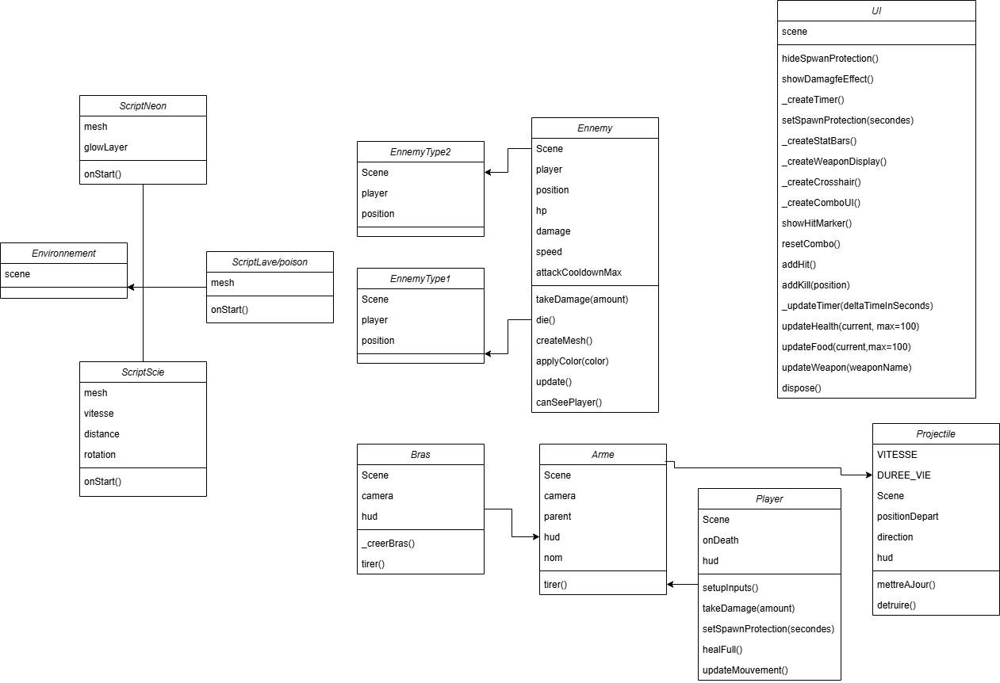
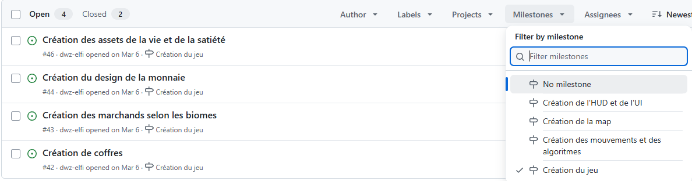
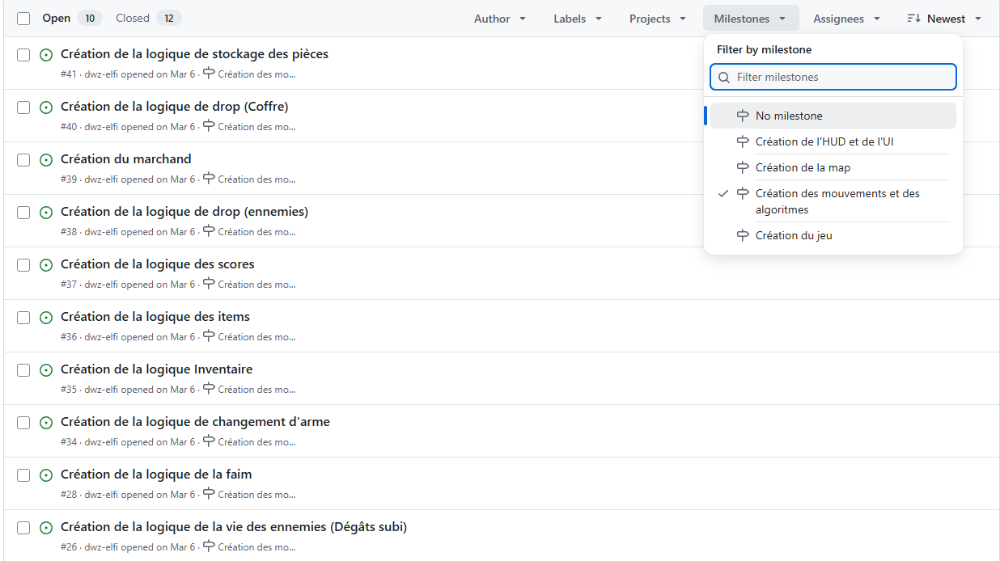
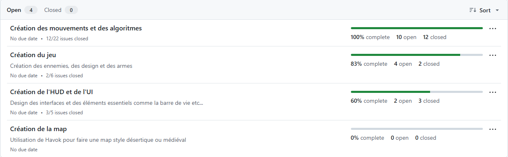

# Projet - L3_web_games

## GamesOnWeb
Lien du concours :
https://www.cgi.com/france/fr-fr/event/games-on-web-2026

Vidéo youtube présentant le site, les jeux en 2 minutes :

Lien vers le jeu hébergé : 

### Participants :
- Guichet Raphael
- Fouilloud Valentin
- Lechevalier Mathis

### Objectifs 

Par équipe, vous devez programmer votre propre jeu 3D, il devra être exécutable dans un navigateur web à jour et développé à l'aide des langages HTML / CSS / Javascript et du framework open source BabylonJS facilitant la programmation des jeux 3D. Toute autre librairie ou framework 3D est interdite. Néanmoins l’usage de librairies utilitaires est permis. Le thème à respecter est "IA Edition".  

## Descriptif du repository  

Les fichiers sources principaux sont :  
- Les scripts contenant les shaders (neon, poison, lave) et les animations pour les scies.
- Arme.js qui est le mesh de l'arme du personnage qui apparaît sur l'HUD avec l'animation de recul et le viseur du joueur.
- Bras.js est la classe qui permet d'avoir un bras qui tient l'arme apparaissant sur l'HUD rien de plus.
- Projectile.js est la classe qui va permettre de voir les balles tirées depuis l'arme avec une animation.
- app.js est le coeur de l'application c'est qui va contenir les cutscene, les état du jeu, la page chargé, les musics/sons, l'engine et tout ce qui est menu.
- CharacterController.js c'est la classe qui va permettre au joueur de bouger, à la barre de vie d'exister (et la barre de nourriture) de prendre en compte les dégâts, les collisions et de mettre en pause quand on appui sur echap.
- config.js c'est la classe qui permet de définir les contrôle (zqsd) et le volume dans le jeu.
- ennemy.js vva contenir tout ce qui est position des ennemies, les hp, les damages la vitesse et la vitesse d'attaque.
- environnement.js c'est l'ensemble de la map, des shaders, des animations d'élément de map de tout ce qui est design.
- style.css va contenir le css du site et mettre en forme pour le tout. 
- ui.js comme son nom l'indique c'est tout ce qui est UI, playerHUD etc...

Les assets sont remplis de texture comme des images (scies) ou de couleurs spécifiques. Il n'y a rien de notable.

Nota Bene : Nous avons voulu au mieux respecter la séparation des responsabilitées de chaque classe car nous voulions respecter le modèle SOLID

### Rapport de Conception  

Au départ nous avions plusieurs idées de jeu,
Scénario 1 :  
Faire un monde ouvert avec du loot généré de manière procédurale et des ennemies qui suivent le joueur perpétuellement et le but c'était de survivre, ce scénario rentrait difficilement dans le thème et beaucoup trop complexe a réaliser dans les temps.  
Scénario 2 :  
Faire une grande map avec des ennemies qui attaque le joueur et qui le suivent peu importe son emplacement et plus le joueur finissait d'ennemies plus il gagnait de l'exp et avec les lvls du joueur il obtenait des bonus (plus d'attaque, de nouvelles armes, plus de vitesse de déplacements etc...) avec du scaling du côté joueur et ennemie.  
Scénario 3 :  
Faire une map zombie comme dans la franchise black ops avec des vagues a survivre et plus on avance dans les vagues plus la difficulté augmente.

Nous avons sélectionné le troisième scénario mais nous nous sommes dit que faire des arènes différentes pour passer des vagues serait plus fun et une meilleure expérience pour les joueurs.  
NB : Nous avons la barre de nourriture car de base nous voulions partir sur le scénario 2.

### Diagramme de classe et conception en Milestones

°  
°  

Milestone détail 1 :  
  

Milestone détail 2 :  

Milestone détail global :  

### Spécificités Techniques  

Outils :  
- npm en version 10.9.2
- Babylon js editor v5.4.0
- VScode en v1.116
- Blender v4.4

Sites :  
- https://editor.babylonjs.com/   (pour la doc en général)  
- https://forum.babylonjs.com/tag/shaders/90   (pour les shaders)  
- Youtube pour suivre des tutos
- https://sandbox.babylonjs.com/  pour éditer des meshs et débugger
- https://polyhaven.com/   (voir des textures)
- https://ambientcg.com/   (pour des assets)
- https://www.textures.com/  (pour avoir des matériaux)

### Aide de l'IA  

## Partie Personnelle  
### Répartition du travail dans le groupe  
Raphaël :  
- UI / UX, Création du mesh de l'arme, création du système de tp quand on clear une arène et création du site vitrine

Mathis :  
- Création des ennemies ainsi que leur algo, création de l'HUD et règlements de bugs et de features un peu partout

Valentin :  
- Création de l'entièreté des maps et des scripts pour les shaders et l'animation des scies

### Répartition en pourcentage de travail
Répartition égal, les travaux effectués par chacun sont trop différent pour pouvoir évaluer sur le projet global.  

### Difficultés rencontrés

